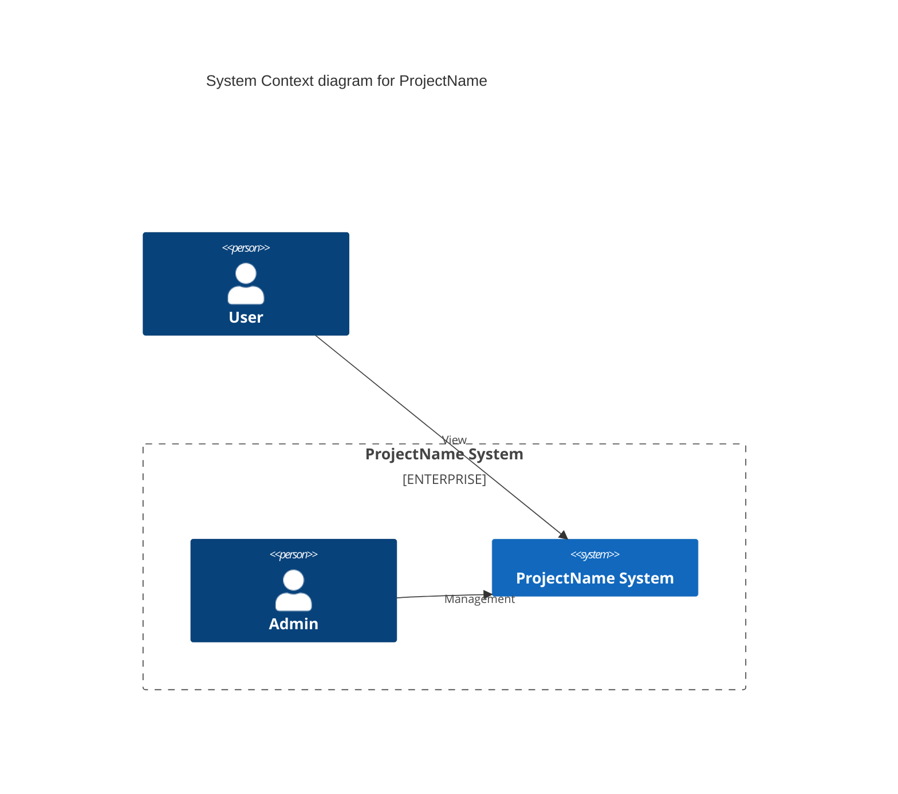
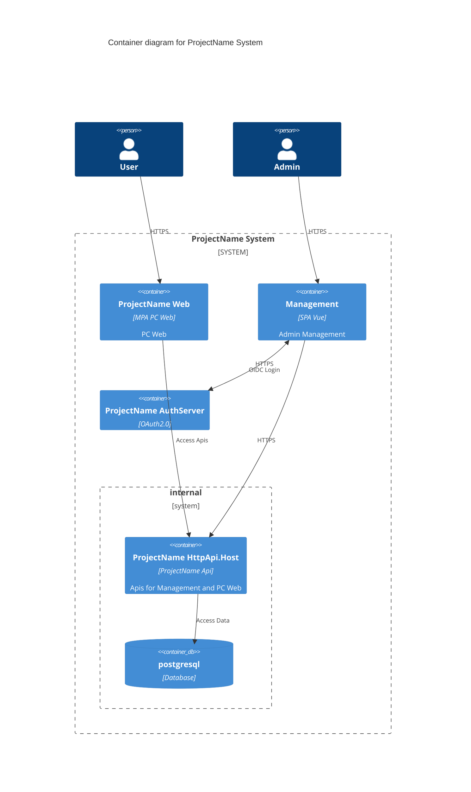

# readme

## Base on

``` bash
abp new CompanyName.ProjectName -dbms PostgreSQL --tiered --theme basic -csf
```

## Next TODO

- 还原 AuthServer 前端资源

```bash
cd src/CompanyName.ProjectName.AuthServer
yarn
abp install-libs
```

- 还原 Web 前端资源

```bash
cd src/CompanyName.ProjectName.Web 
yarn
abp install-libs
```

- 修改 StringEncryption.DefaultPassPhrase
- 需要 redis 实例，默认密码 123qwe
- 需要 postgresql 实例，默认密码 myPassword，用 postgres 账号

https://code.visualstudio.com/Docs/editor/debugging#_multitarget-debugging


## setup git hook to enforce commit-msg format

Auto tag and generate changelog.md by `commit-and-tag-version`
[conventional commits](https://www.conventionalcommits.org/en/v1.0.0/#summary)

```bash
./set-git-hook.sh
npm i -g commit-and-tag-version # https://github.com/absolute-version/commit-and-tag-version#bumpfiles-packagefiles-and-updaters
commit-and-tag-version # --frist-release 
```

config `.versionrc` follow: [conventional-changelog-config-spec](https://github.com/conventional-changelog/conventional-changelog-config-spec/blob/master/versions/2.2.0/schema.json)


## ProjectName



