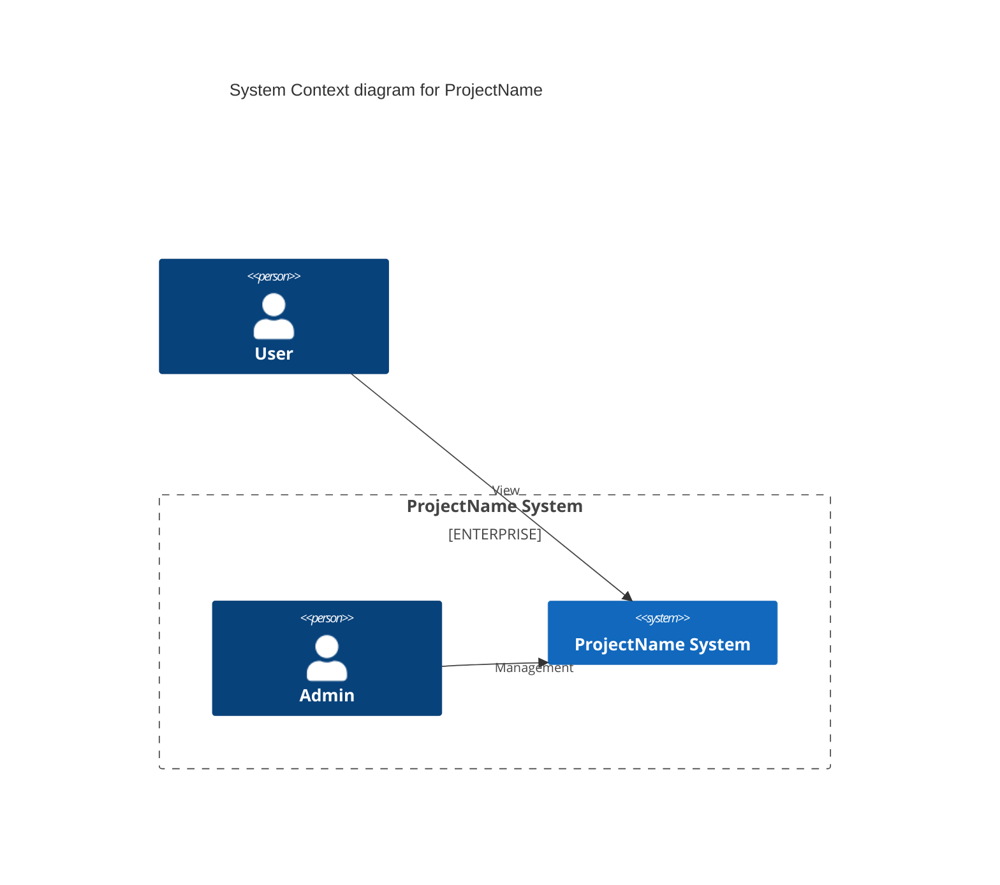
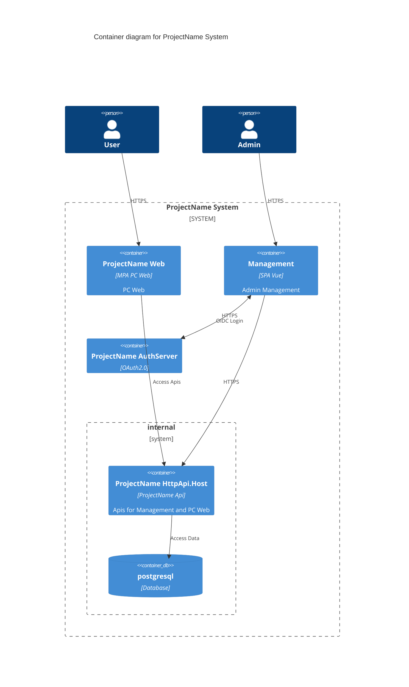

# readme

## Base on

``` bash
abp new CompanyName.ProjectName -dbms PostgreSQL --tiered --theme basic -csf
```

## Next TODO

- 还原 AuthServer 前端资源

```bash
cd src/CompanyName.ProjectName.AuthServer
yarn
abp install-libs # git add wwwroot -f 避免cicd中重新构建前端资产
```

- 还原 Web 前端资源

```bash
cd src/CompanyName.ProjectName.Web 
yarn
abp install-libs # git add wwwroot -f 避免cicd中重新构建前端资产
```

- 修改 StringEncryption.DefaultPassPhrase
- 需要 redis 实例，默认密码 123qwe
- 需要 postgresql 实例，默认密码 123qwe，用 postgres 账号
- 配置 DbMigrator 的 appsettings.json OpenIddict 客户端域名
- AuthServer 配置自签证书 `pki/ca.pfx`
  - 生成 ca.pfx [self-signed-certificates-guide](https://learn.microsoft.com/en-us/dotnet/core/additional-tools/self-signed-certificates-guide)
  - 添加 appsettings.json 配置节
  - 配置 csproj 如果较新则复制（请注意，默认 pfx 证书文件不会被 git 追踪）
- 初始化 EntityFrameworkCore 的 Migrations

```bash
cd src/CompanyName.ProjectName.EntityFrameworkCore
dotnet ef migrations add Init
```


https://code.visualstudio.com/Docs/editor/debugging#_multitarget-debugging

### 数据库迁移和 k8s 配置

通过执行 `CompanyName.ProjectName.DbMigrator` 进行数据库迁移和 DataSeed。  

可以在该项目构建为 docker 镜像后，作为 initContainer 和 `CompanyName.ProjectName.HttpApi.Host` 的镜像一起组成 k8s pod 。

## setup git hook to enforce commit-msg format

Auto tag and generate changelog.md by `commit-and-tag-version`
[conventional commits](https://www.conventionalcommits.org/en/v1.0.0/#summary)

```bash
./set-git-hook.sh
npm i -g commit-and-tag-version # https://github.com/absolute-version/commit-and-tag-version#bumpfiles-packagefiles-and-updaters
commit-and-tag-version # --frist-release 
```

config `.versionrc` follow: [conventional-changelog-config-spec](https://github.com/conventional-changelog/conventional-changelog-config-spec/blob/master/versions/2.2.0/schema.json)


## ProjectName




